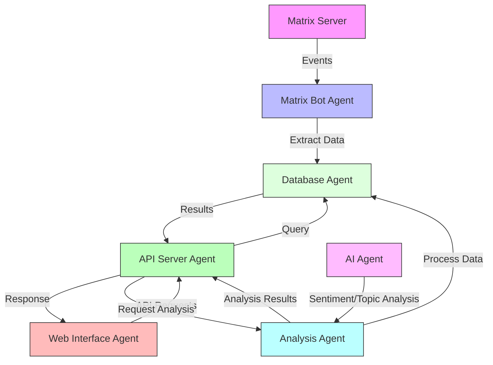

# Matrix Historian Agents

This document describes the various agents and services that make up the Matrix Historian system.

## System Architecture

The Matrix Historian system consists of several interconnected agents that work together to collect, store, and analyze Matrix messages:



## Agent Descriptions

### 1. Matrix Bot Agent
**Location**: `src/app/bot/`
**Purpose**: Connects to Matrix servers and collects message events

**Key Components**:
- `client.py`: Bot connection and authentication
- `handler.py`: Message event processing and storage

**Responsibilities**:
- Authenticate with Matrix homeserver
- Join configured rooms
- Listen for message events
- Extract message data (content, sender, timestamp, room)
- Store messages in database
- Handle connection errors and reconnection

**Configuration**:
```bash
MATRIX_HOMESERVER=https://your-matrix-server.com
MATRIX_USER=@bot:your-matrix-server.com
MATRIX_PASSWORD=your-bot-password
```

### 2. API Server Agent
**Location**: `src/app/api/`
**Purpose**: Provides RESTful API endpoints for data access

**Key Components**:
- `routes.py`: API endpoint definitions
- `analytics.py`: Analytics-specific endpoints

**Responsibilities**:
- Serve HTTP API requests
- Query database for messages
- Provide analytics data
- Handle authentication (if needed)
- Rate limiting and error handling

**Endpoints**:
- `GET /api/v1/messages` - Retrieve messages with filtering
- `GET /api/v1/analytics/overview` - Get activity overview
- `GET /api/v1/analytics/wordcloud` - Generate word cloud data
- `GET /api/v1/analytics/sentiment` - Get sentiment analysis
- `GET /api/v1/health` - Health check endpoint

### 3. Database Agent
**Location**: `src/app/db/`
**Purpose**: Manages data persistence and retrieval

**Key Components**:
- `database.py`: Database connection and initialization
- `models/`: SQLAlchemy models
- `crud/`: Database operations

**Responsibilities**:
- Initialize SQLite database
- Create and manage database tables
- Provide CRUD operations for messages
- Handle database migrations
- Optimize queries for performance

**Data Models**:
- `Message`: Core message data
- `Room`: Room information
- `User`: User profiles
- `Analytics`: Cached analysis results

### 4. Web Interface Agent
**Location**: `src/app/webui/`
**Purpose**: Provides user interface for browsing and analyzing messages

**Key Components**:
- `main.py`: Streamlit application
- `tools/`: Analysis tools and utilities

**Responsibilities**:
- Render web interface
- Display message search results
- Show analytics visualizations
- Handle user interactions
- Provide filtering and sorting options

**Features**:
- Message search and filtering
- Analytics dashboard
- Interactive charts and graphs
- Export functionality
- Real-time updates

### 5. Analysis Agent
**Location**: `src/app/ai/`
**Purpose**: Processes data for analytics and insights

**Key Components**:
- `analyzer.py`: Core analysis logic

**Responsibilities**:
- Generate activity overviews
- Create word clouds and frequency analysis
- Analyze user interaction patterns
- Track topic evolution
- Perform sentiment analysis
- Generate heatmaps and visualizations

**Analysis Types**:
- **Activity Analysis**: Message trends and user activity
- **Content Analysis**: Word frequency and topic extraction
- **Social Analysis**: User interaction networks
- **Temporal Analysis**: Time-based patterns and trends
- **Sentiment Analysis**: Emotional tone of conversations

### 6. AI Agent
**Purpose**: Provides AI-powered analysis capabilities

**Responsibilities**:
- Integrate with external AI services (Groq API)
- Perform sentiment analysis on messages
- Extract topics and themes
- Generate insights and summaries
- Handle AI service rate limiting

**Configuration**:
```bash
GROQ_API_KEY=your-groq-api-key
```

## Agent Communication

### Data Flow
1. **Matrix Bot Agent** → **Database Agent**: Store incoming messages
2. **Web Interface Agent** → **API Server Agent**: Request data and analytics
3. **API Server Agent** → **Database Agent**: Query stored data
4. **API Server Agent** → **Analysis Agent**: Request processed analytics
5. **Analysis Agent** → **AI Agent**: Request AI-powered insights

### Inter-Agent Protocols
- **HTTP/REST**: Web Interface ↔ API Server
- **SQL**: API Server ↔ Database
- **Direct Function Calls**: Analysis ↔ AI services
- **Matrix Protocol**: Bot ↔ Matrix Server

## Deployment Configurations

### Docker Compose Setup
The system uses Docker Compose to orchestrate multiple agents:

```yaml
services:
  app:          # API Server + Matrix Bot + Database + Analysis
  webui:        # Web Interface Agent
```

### Environment Variables
Each agent requires specific configuration:

```bash
# Matrix Bot Agent
MATRIX_HOMESERVER=https://your-matrix-server.com
MATRIX_USER=@bot:your-matrix-server.com
MATRIX_PASSWORD=your-bot-password

# Database Agent
DATABASE_URL=sqlite:///app/db/database.db

# AI Agent
GROQ_API_KEY=your-groq-api-key

# Web Interface Agent
API_URL=http://app:8000/api/v1
```

### Dependency Management
The system uses **uv** for fast and reliable Python package management. All dependencies are defined in `pyproject.toml` at the project root.

**To install dependencies locally:**
```bash
# Install uv
curl -LsSf https://astral.sh/uv/install.sh | sh

# Install project dependencies
uv pip install matrix-nio==0.24.0 simplematrixbotlib==2.12.3 h11==0.14.0 httpcore==0.17.3 fastapi==0.115.12 uvicorn==0.34.2 sqlalchemy==2.0.40 python-multipart==0.0.20 pydantic==2.11.4 email-validator==2.2.0 pytest==8.3.5 python-dotenv==1.1.0 backoff==2.2.1 groq streamlit==1.45.0 pandas==2.2.3 requests==2.32.3 humanize==4.12.3 plotly==5.20.0 wordcloud==1.9.3 jieba==0.42.1 networkx==3.2.1 matplotlib==3.8.0 scipy==1.12.0

# Or using traditional pip
pip install -r src/requirements.txt
```

Docker builds automatically use uv for dependency installation.

## Monitoring and Health Checks

### Health Check Endpoints
- **API Server**: `GET /api/v1/health`
- **Web Interface**: `GET /?health=check`

### Logging
Each agent logs to stdout with structured logging:
- **Matrix Bot**: Connection status, message processing
- **API Server**: Request/response logs, errors
- **Database**: Query performance, connection status
- **Analysis**: Processing time, AI service calls

### Metrics
- Message collection rate
- API response times
- Database query performance
- AI service usage and costs
- User activity and engagement

## Scaling Considerations

### Horizontal Scaling
- **API Server**: Can be scaled behind a load balancer
- **Database**: Consider PostgreSQL for production
- **Analysis**: Can be moved to separate worker processes

### Vertical Scaling
- **Matrix Bot**: Single instance recommended
- **Web Interface**: Stateless, can be replicated
- **Analysis**: CPU-intensive, benefit from more cores

## Security Considerations

### Authentication
- Matrix bot uses homeserver authentication
- API endpoints may require additional authentication
- Web interface access control

### Data Privacy
- Messages are stored locally
- No data sent to external services except AI analysis
- Configurable data retention policies

### Network Security
- HTTPS for all external communications
- Internal service communication over Docker network
- Firewall rules for exposed ports

## Troubleshooting

### Common Issues
1. **Matrix Bot Connection**: Check homeserver URL and credentials
2. **Database Issues**: Verify SQLite file permissions
3. **API Errors**: Check service dependencies
4. **Analysis Failures**: Verify AI service configuration

### Debug Commands
```bash
# Check service status
docker-compose ps

# View logs
docker-compose logs [service-name]

# Test API endpoints
curl http://localhost:8001/api/v1/health

# Check database
sqlite3 database.db ".tables"
```

## Development

### Adding New Agents
1. Create agent directory in `src/app/`
2. Implement agent interface
3. Add to Docker Compose configuration
4. Update environment variables
5. Add health checks and monitoring

### Agent Interface Standards
- Use async/await for I/O operations
- Implement proper error handling
- Add comprehensive logging
- Include health check endpoints
- Follow configuration management patterns

### Development Tools
- **Python Version**: 3.12+
- **Package Manager**: uv (for fast dependency resolution)
- **Testing**: pytest
- **Code Style**: PEP8 compliance
- **Documentation**: Comprehensive docstrings and markdown docs
