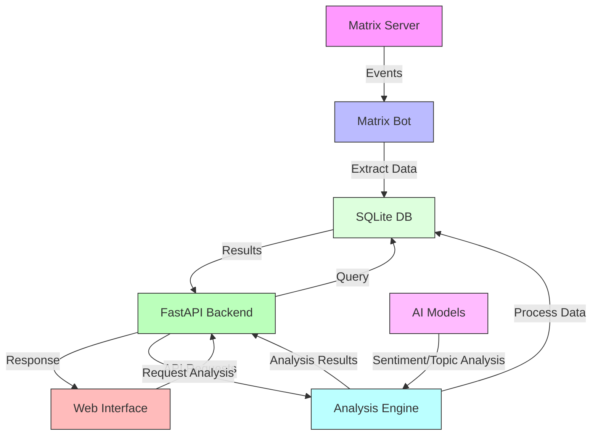

# Matrix Historian

A Matrix message archival and analysis tool.





## Features

- Automatically records Matrix room message history
- Supports message search by room, user, and content
- Provides Web interface for message browsing and searching
- Docker deployment support
- Uses SQLite database for message storage

### Data Analysis Features

- **Activity Overview**: Displays message trends and user activity levels
- **Word Cloud Analysis**: Generates statistics and visualizations of word frequency in chats
- **User Interaction**: Shows the network and intensity of interactions between users
- **Topic Analysis**: Tracks the evolution of topics over time
- **Sentiment Analysis**: AI-based analysis of message sentiment tendencies
- **Activity Analysis**: Displays heatmaps of group activity during different times

All analysis features support filtering by time range and room.

## Quick Start

### Deploy with Docker

1. Clone the repository
```bash
git clone https://github.com/yourusername/matrix-historian.git
cd matrix-historian
```

2. Configure environment variables
```bash
cp .env.example .env
# Edit .env file to set Matrix bot account information
```

3. Start the service
```bash
cd src
docker-compose up -d
```

Services will start on the following ports:
- API service: http://localhost:8001
- Web interface: http://localhost:8502

<!-- ### Manual Configuration

Refer to [Gitbook Documentation](https://your-gitbook-link) for detailed manual configuration instructions. -->

## Configuration

Main configuration items:
- `MATRIX_HOMESERVER`: Matrix server address
- `MATRIX_USER`: Bot username
- `MATRIX_PASSWORD`: Bot password

### Environment Variables

```bash
# Required environment variables
MATRIX_HOMESERVER=...
BOT_USER_ID=...
BOT_ACCESS_TOKEN=...

# AI analysis related configuration (optional)
GROQ_API_KEY=...  # For sentiment analysis
```

## Usage

1. Visit http://localhost:8501 to open the Web interface
2. Use the search box to search messages
3. Use filters to filter messages by room or user

### Data Analysis

1. Go to the "Message Analysis" page on the Web interface
2. Use the sidebar to select the analysis time range and target room
3. View various analysis charts and statistics

## Development

### Project Dependencies

This project uses **uv** for fast and reliable dependency management. Dependencies are defined in `pyproject.toml`.

**Install uv:**
```bash
curl -LsSf https://astral.sh/uv/install.sh | sh
```

**Install dependencies:**
```bash
# Using uv pip install (recommended)
uv pip install matrix-nio==0.24.0 simplematrixbotlib==2.12.3 h11==0.14.0 httpcore==0.17.3 fastapi==0.115.12 uvicorn==0.34.2 sqlalchemy==2.0.40 python-multipart==0.0.20 pydantic==2.11.4 email-validator==2.2.0 pytest==8.3.5 python-dotenv==1.1.0 backoff==2.2.1 groq streamlit==1.45.0 pandas==2.2.3 requests==2.32.3 humanize==4.12.3 plotly==5.20.0 wordcloud==1.9.3 jieba==0.42.1 networkx==3.2.1 matplotlib==3.8.0 scipy==1.12.0

# Or using traditional pip
pip install -r src/requirements.txt
```

### Project Structure
```
matrix-historian/
├── pyproject.toml      # Python project configuration and dependencies
├── src/
│   ├── app/             # Main application code
│   │   ├── api/        # API interfaces
│   │   ├── bot/        # Matrix bot
│   │   ├── db/         # Database models
│   │   └── webui/      # Web interface
│   ├── tests/          # Test code
│   ├── Dockerfile      # Main API server Dockerfile
│   └── docker-compose.yml
└── docs/               # Documentation
```

See [Development Guide](docs/development.md) for detailed setup instructions.

<!-- ## Documentation

[Gitbook Documentation](https://your-gitbook-link) -->

## License

This project is licensed under the MIT License

[中文文档](README_zh.md)

