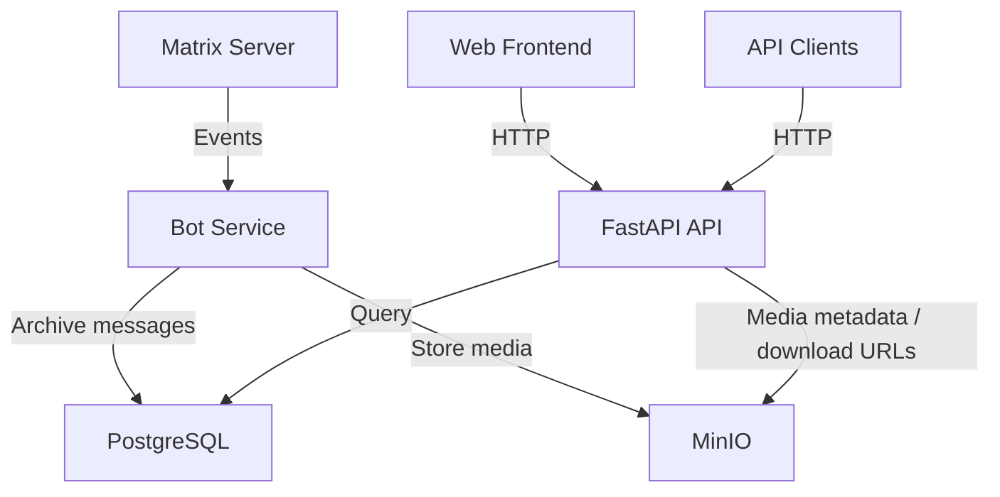

# Matrix Historian

A Matrix message archival and analytics platform with a Python microservice backend, PostgreSQL + MinIO storage, and a Svelte web frontend.

## Architecture


```mermaid
graph TB
    A[Matrix Server] -->|Events| B[Bot Service]
    B -->|Archive messages| C[PostgreSQL]
    B -->|Store media| D[MinIO]

    E[Web Frontend]
    F[API Clients]
    E -->|HTTP| G[FastAPI API]
    F -->|HTTP| G
    G -->|Query| C
    G -->|Media metadata / download URLs| D
```

## Components

- **Bot service** (`services/bot/`): connects to Matrix and archives room events into PostgreSQL, downloading media into MinIO.
- **API service** (`services/api/`): FastAPI service for messages, media, rooms, users, and analytics.
- **Web service** (`services/web/`): SvelteKit-based UI for browsing archives and analytics.
- **Shared package** (`shared/`): common models, schemas, CRUD, DB, and storage helpers.
- **PostgreSQL**: primary metadata and message storage.
- **MinIO**: S3-compatible object storage for media attachments.

## Features

- Automatic Matrix message archiving
- Search and filter by room, user, content, and time range
- Media archival and download support via MinIO
- Analytics endpoints and dashboard views (including room selector, time range picker, server-side pagination, and advanced visualizations)
- Docker Compose deployment for local or self-hosted setups
- Web frontend with:
  - **Internationalization**: English (`en`) and Simplified Chinese (`zh-CN`)
  - **Timezone display controls**: switch between **Local** (browser timezone) and **UTC**
  - **Server-side pagination**: for rooms, users, and messages
  - **Advanced search**: with filters for room, user, content, and time range

## Timezone and i18n behavior

Matrix Historian stores timestamps in the backend/database as **UTC**.

The **frontend is responsible for presentation**:
- converting UTC timestamps for display in the browser's local timezone when **Local** is selected
- allowing users to switch back to **UTC** display
- localizing UI strings for **English** and **Simplified Chinese**

This means timezone conversion and UI i18n do **not** require backend or database schema changes.

## Quick start

### Prerequisites

- Docker and Docker Compose
- A Matrix account for the bot
- Optional: `GROQ_API_KEY` for AI-powered analytics features

### 1. Clone the repository

```bash
git clone https://github.com/WeepingDogel/matrix-historian.git
cd matrix-historian
```

### 2. Configure environment

```bash
cp .env.example .env
```

Important variables in `.env`:

- `MATRIX_HOMESERVER`
- `MATRIX_USER`
- `MATRIX_PASSWORD`
- `DATABASE_URL`
- `API_PORT`
- `WEB_PORT`
- `MINIO_ROOT_USER`
- `MINIO_ROOT_PASSWORD`
- `MINIO_ENDPOINT`
- `MINIO_BUCKET`
- `MINIO_PUBLIC_URL` (optional, useful for externally accessible media URLs)
- `GROQ_API_KEY` (optional)

### 3. Start the stack

```bash
docker-compose up -d
```

### 4. Check running services

```bash
docker-compose ps
docker-compose logs -f
```

Default entrypoints:

- **Web UI**: http://localhost:3000
- **API**: http://localhost:8500
- **API docs**: http://localhost:8500/docs
- **MinIO API**: http://localhost:9000
- **MinIO Console**: http://localhost:9001

## Docker services

The default `docker-compose.yml` starts:

- `db` → PostgreSQL 16
- `minio` → object storage for attachments
- `bot` → Matrix archiver
- `api` → FastAPI backend
- `web` → SvelteKit frontend

## Configuration

### Environment variables

| Variable | Description | Default |
|---|---|---|
| `MATRIX_HOMESERVER` | Matrix homeserver URL | - |
| `MATRIX_USER` | Bot username / MXID | - |
| `MATRIX_PASSWORD` | Bot password | - |
| `DATABASE_URL` | PostgreSQL connection string | `postgresql://<db_user>:<db_password>@db:5432/historian` |
| `API_PORT` | Published API port | `8500` |
| `WEB_PORT` | Published web port | `3000` |
| `MINIO_ROOT_USER` | MinIO admin username | `<minio_admin_user>` |
| `MINIO_ROOT_PASSWORD` | MinIO admin password | `<minio_admin_password>` |
| `MINIO_ENDPOINT` | Internal MinIO endpoint | `minio:9000` |
| `MINIO_BUCKET` | MinIO bucket name | `matrix-media` |
| `MINIO_API_PORT` | Published MinIO API port | `9000` |
| `MINIO_CONSOLE_PORT` | Published MinIO Console port | `9001` |
| `MINIO_PUBLIC_URL` | External/public MinIO base URL | empty |
| `GROQ_API_KEY` | Optional key for AI analytics | empty |

## Web frontend notes

The frontend lives in `services/web/` and is built with SvelteKit.

Notable UI behavior:

- language preference is stored client-side
- timezone display preference is stored client-side
- timestamps remain UTC in API/database responses and are formatted in the browser for presentation

## API overview

Base path: `/api/v1`

Main endpoint groups:

- `messages`
- `rooms`
- `users`
- `analytics`
- `media`

For interactive docs, use Swagger at `http://localhost:8500/docs`.

## Project structure

```text
matrix-historian/
├── docker-compose.yml
├── docker-compose.production.yml
├── docker-compose.staging.yml
├── .env.example
├── docs/
├── services/
│   ├── api/
│   ├── bot/
│   └── web/
├── shared/
└── tests/
```

## Development

### Backend

```bash
# from repo root
python -m venv venv
source venv/bin/activate
pip install -e ./shared
pip install -r services/api/requirements.txt
pip install -r services/bot/requirements.txt
```

### Frontend

```bash
cd services/web
npm install
npm run dev
```

### Run services locally

```bash
# terminal 1
cd services/api/app
uvicorn main:app --reload --port 8000

# terminal 2
cd services/bot/app
python main.py

# terminal 3
cd services/web
npm run dev
```

## Documentation

See `docs/` for focused documentation:

- `docs/overview.md`
- `docs/get-started.md`
- `docs/deployment.md`
- `docs/development.md`
- `docs/reference/api-reference.md`

## Migration notes

Older documentation may still mention:

- SQLite
- API-only / frontend removed
- old port mappings
- pre-Svelte frontend structure

Those descriptions are obsolete for the current main branch.

## License

MIT — see [LICENSE](LICENSE).

## Chinese documentation

See [README_zh.md](README_zh.md).
