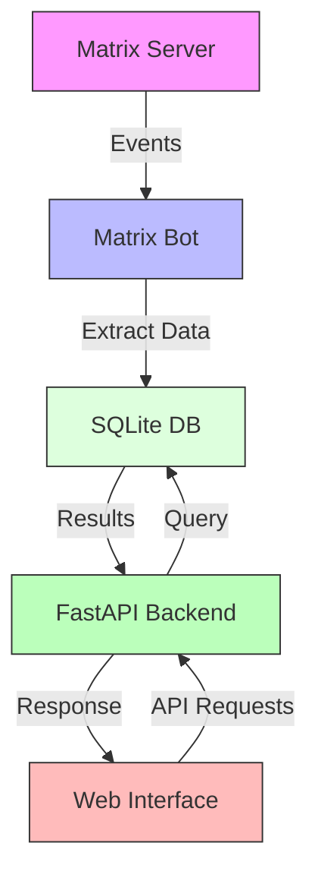

# Matrix Historian

A Matrix message archival and search service.





## Features

- Automatically records Matrix room message history
- Supports message search by room, user, and content
- Provides Web interface for message browsing and searching
- Docker deployment support
- Uses SQLite database for message storage

## Quick Start

### Deploy with Docker

1. Clone the repository
```bash
git clone https://github.com/yourusername/matrix-historian.git
cd matrix-historian/src
```

2. Configure environment variables
```bash
cp .env.example .env
# Edit .env file to set Matrix bot account information
```

3. Start the service
```bash
docker-compose up -d
```

Services will start on the following ports:
- API service: http://localhost:8001
- Web interface: http://localhost:8502

<!-- ### Manual Configuration

Refer to [Gitbook Documentation](https://your-gitbook-link) for detailed manual configuration instructions. -->

## Configuration

Main configuration items:
- `MATRIX_HOMESERVER`: Matrix server address
- `MATRIX_USER`: Bot username
- `MATRIX_PASSWORD`: Bot password

## Usage

1. Visit http://localhost:8502 to open the Web interface
2. Use the search box to search messages
3. Use filters to filter messages by room or user

## Development

Project structure:
```
src/
├── app/             # Main application code
│   ├── api/        # API interfaces
│   ├── bot/        # Matrix bot
│   ├── db/         # Database models
│   └── webui/      # Web interface
├── tests/          # Test code
└── docker-compose.yml
```

<!-- ## Documentation

[Gitbook Documentation](https://your-gitbook-link) -->

## License

This project is licensed under the MIT License

[中文文档](README_zh.md)

