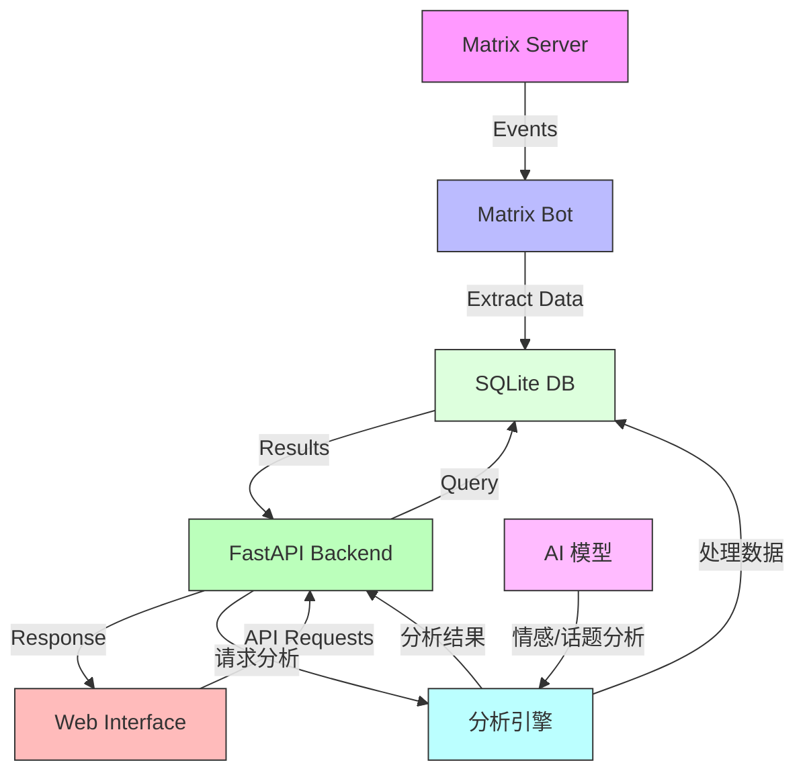

# Matrix Historian

一个Matrix消息存档、分析和搜索服务。





## 功能特性

- 自动记录Matrix房间的消息历史
- 支持按房间、用户和内容搜索消息
- 提供Web界面进行消息浏览和搜索
- 强大的数据分析功能：
  - 活动概览和趋势分析
  - 词云和词频统计
  - 用户互动网络分析
  - 话题演变跟踪
  - AI驱动的情感分析
  - 活跃度热力图
- 支持按房间筛选的分析功能
- 支持Docker部署
- 使用SQLite数据库存储消息

## 快速开始

### 使用Docker部署

1. 克隆仓库
```bash
git clone https://github.com/yourusername/matrix-historian.git
cd matrix-historian
```

2. 配置环境变量
```bash
cp .env.example .env
# 编辑 .env 文件，设置Matrix bot账号信息
```

3. 启动服务
```bash
cd src
docker-compose up -d
```

服务将在以下端口启动：
- API服务: http://localhost:8001
- Web界面: http://localhost:8502

### 手动配置

参考 `docs/get-started.md` 获取详细的手动配置说明。

## 配置说明

主要配置项：
- `MATRIX_HOMESERVER`: Matrix服务器地址
- `MATRIX_USER`: Bot用户名
- `MATRIX_PASSWORD`: Bot密码
- `GROQ_API_KEY`: Groq API KEY，用于访问模型

### 环境变量

```bash
# 必需的环境变量
MATRIX_HOMESERVER=...
BOT_USER_ID=...
BOT_ACCESS_TOKEN=...

# AI分析相关配置（可选）
GROQ_API_KEY=...  # 用于AI驱动的分析功能
```

## 使用方法

1. 访问 http://localhost:8501 打开Web界面
2. 使用搜索框搜索消息
3. 使用过滤器按房间或用户筛选消息
4. 访问"消息分析"页面查看数据分析结果：
   - 查看活动趋势和用户参与度
   - 生成互动网络图和词云
   - 分析群组活跃时段
   - 跟踪话题演变
   - 获取AI驱动的情感分析

## 数据分析功能

访问"消息分析"页面查看详细的数据分析结果：

1. **活动概览**: 显示消息趋势和用户活跃度
2. **词云分析**: 生成聊天中词频统计和可视化
3. **用户互动**: 展示用户间的网络和互动强度
4. **话题分析**: 跟踪话题随时间的演变
5. **情感分析**: 基于AI的消息情感倾向分析
6. **活跃度分析**: 显示群组在不同时段的活跃度热力图

所有分析功能都支持按时间范围和房间进行筛选。

## 技术架构

### 技术栈
- **后端**: Python 3.12, FastAPI, SQLAlchemy, SQLite
- **前端**: Streamlit, Pandas, Plotly
- **Matrix机器人**: SimpleMatrixBotLib
- **AI分析**: Groq API
- **依赖管理**: uv (快速可靠的Python包管理工具)

### 数据流程
1. Matrix机器人连接到Matrix服务器
2. 自动收集房间消息事件
3. 提取并存储消息数据到SQLite数据库
4. Web界面通过FastAPI后端查询数据
5. 分析引擎处理数据并提供AI驱动的洞察

## 开发说明

### 项目结构
```
matrix-historian/
├── pyproject.toml      # Python项目配置和依赖定义
├── src/
│   ├── app/             # 主应用代码
│   │   ├── api/        # API接口
│   │   ├── bot/        # Matrix机器人
│   │   ├── db/         # 数据库模型
│   │   ├── models/     # 数据模型
│   │   ├── schemas/    # API模式
│   │   ├── crud/       # 数据库操作
│   │   ├── ai/         # AI分析模块
│   │   └── webui/      # Web界面
│   ├── tests/          # 测试代码
│   ├── Dockerfile      # API服务器Dockerfile
│   └── docker-compose.yml
└── docs/               # 文档
```

### 开发环境设置

本项目使用 **uv** 进行快速可靠的依赖管理。依赖项定义在 `pyproject.toml` 中。

1. 克隆仓库并进入目录
```bash
git clone https://github.com/yourusername/matrix-historian.git
cd matrix-historian
```

2. 安装 uv
```bash
curl -LsSf https://astral.sh/uv/install.sh | sh
```

3. 安装项目依赖

使用 uv pip install：
```bash
cd src
uv pip install matrix-nio==0.24.0 simplematrixbotlib==2.12.3 h11==0.14.0 httpcore==0.17.3 fastapi==0.115.12 uvicorn==0.34.2 sqlalchemy==2.0.40 python-multipart==0.0.20 pydantic==2.11.4 email-validator==2.2.0 pytest==8.3.5 python-dotenv==1.1.0 backoff==2.2.1 groq streamlit==1.45.0 pandas==2.2.3 requests==2.32.3 humanize==4.12.3 plotly==5.20.0 wordcloud==1.9.3 jieba==0.42.1 networkx==3.2.1 matplotlib==3.8.0 scipy==1.12.0
```

或者使用传统方法：
```bash
python -m venv .venv
source .venv/bin/activate  # Linux/macOS
.venv\Scripts\activate     # Windows
pip install -r requirements.txt
```

4. 初始化数据库
```bash
python app/db/database.py
```

5. 启动服务
```bash
# 启动API服务
uvicorn app.main:app --host 0.0.0.0 --port 8000

# 启动Web界面（新终端）
streamlit run app/webui/main.py --server.port=8501 --server.address=0.0.0.0
```

详见 [开发指南](docs/development.md) 获取详细设置说明。

## 故障排除

### 常见问题

1. **机器人无法连接Matrix服务器**
   - 检查`MATRIX_HOMESERVER`配置是否正确
   - 确认机器人账号和密码正确
   - 检查网络连接

2. **Web界面无法访问**
   - 确认端口8001和8502未被占用
   - 检查Docker容器是否正常运行
   - 查看容器日志: `docker-compose logs`

3. **数据分析功能异常**
   - 确认`GROQ_API_KEY`配置正确
   - 检查API配额是否充足
   - 查看应用日志获取详细错误信息

### 日志查看
```bash
# 查看所有服务日志
docker-compose logs

# 查看特定服务日志
docker-compose logs app
docker-compose logs webui
```

## 贡献指南

欢迎贡献代码！请遵循以下步骤：

1. Fork 本仓库
2. 创建功能分支: `git checkout -b feature/your-feature`
3. 提交更改: `git commit -am 'Add some feature'`
4. 推送分支: `git push origin feature/your-feature`
5. 提交 Pull Request

## 许可证

本项目采用 MIT 许可证

[English](README.md)
