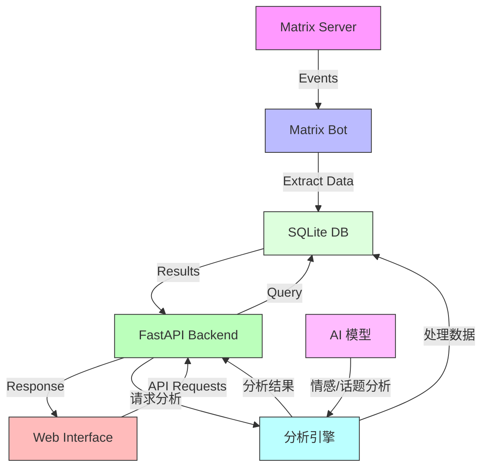

# Matrix Historian

一个Matrix消息存档、分析和搜索服务。





## 功能特性

- 自动记录Matrix房间的消息历史
- 支持按房间、用户和内容搜索消息
- 提供Web界面进行消息浏览和搜索
- 强大的数据分析功能：
  - 活动概览和趋势分析
  - 词云和词频统计
  - 用户互动网络分析
  - 话题演变跟踪
  - AI驱动的情感分析
  - 活跃度热力图
- 支持按房间筛选的分析功能
- 支持Docker部署
- 使用SQLite数据库存储消息

## 快速开始

### 使用Docker部署

1. 克隆仓库
```bash
git clone https://github.com/yourusername/matrix-historian.git
cd matrix-historian/src
```

2. 配置环境变量
```bash
cp .env.example .env
# 编辑 .env 文件，设置Matrix bot账号信息
```

3. 启动服务
```bash
docker-compose up -d
```

服务将在以下端口启动：
- API服务: http://localhost:8001
- Web界面: http://localhost:8502

### 手动配置

参考 `docs/get-started.md` 获取详细的手动配置说明。

## 配置说明

主要配置项：
- `MATRIX_HOMESERVER`: Matrix服务器地址
- `MATRIX_USER`: Bot用户名
- `MATRIX_PASSWORD`: Bot密码
- `GROQ_API_KEY`: Groq API KEY，用于访问模型

### 环境变量

```bash
# 必需的环境变量
MATRIX_HOMESERVER=...
BOT_USER_ID=...
BOT_ACCESS_TOKEN=...

# AI分析相关配置（可选）
GROQ_API_KEY=...  # 用于AI驱动的分析功能
```

## 使用方法

1. 访问 http://localhost:8502 打开Web界面
2. 使用搜索框搜索消息
3. 使用过滤器按房间或用户筛选消息
4. 访问"消息分析"页面查看数据分析结果：
   - 查看活动趋势和用户参与度
   - 生成互动网络图和词云
   - 分析群组活跃时段
   - 跟踪话题演变
   - 获取AI驱动的情感分析

## 开发说明

项目结构：
```
src/
├── app/             # 主应用代码
│   ├── api/        # API接口
│   ├── bot/        # Matrix机器人
│   ├── db/         # 数据库模型
│   └── webui/      # Web界面
├── tests/          # 测试代码
└── docker-compose.yml
```

## 许可证

本项目采用 MIT 许可证

[English](README.md)
