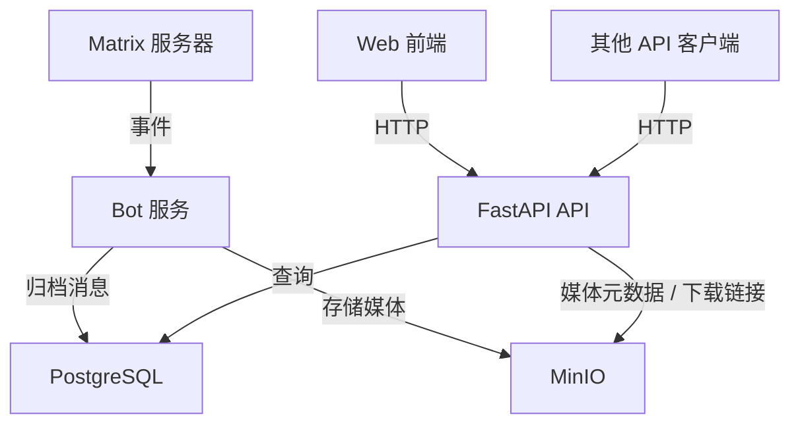

# Matrix Historian

一个用于 Matrix 消息归档、检索与分析的平台，采用 Python 微服务后端、PostgreSQL + MinIO 存储，以及 Svelte Web 前端。

## 架构概览


```mermaid
graph TB
    A[Matrix 服务器] -->|事件| B[Bot 服务]
    B -->|归档消息| C[PostgreSQL]
    B -->|存储媒体| D[MinIO]

    E[Web 前端]
    F[其他 API 客户端]
    E -->|HTTP| G[FastAPI API]
    F -->|HTTP| G
    G -->|查询| C
    G -->|媒体元数据 / 下载链接| D
```

## 核心组件

- **Bot 服务**（`services/bot/`）：连接 Matrix，归档房间消息与事件，并将媒体文件下载到 MinIO。
- **API 服务**（`services/api/`）：提供消息、媒体、房间、用户、分析等 FastAPI 接口。
- **Web 服务**（`services/web/`）：基于 SvelteKit 的前端界面，用于浏览消息归档和分析数据。
- **共享包**（`shared/`）：公共模型、Schema、CRUD、数据库和对象存储工具。
- **PostgreSQL**：存储消息及相关元数据。
- **MinIO**：S3 兼容对象存储，用于保存附件媒体。

## 功能特性

- 自动归档 Matrix 房间消息
- 按房间、用户、关键词、时间范围进行搜索和过滤
- 通过 MinIO 存储和访问媒体附件
- 提供分析接口与可视化页面（包含房间选择器、时间范围选择器、服务器端分页等高级功能）
- 支持 Docker Compose 一键部署
- Web 前端支持：
  - **国际化**：英文（`en`）与简体中文（`zh-CN`）
  - **时区显示切换**：可在 **本地时区** 与 **UTC** 之间切换
  - **服务器端分页**：支持房间、用户、消息的分页加载
  - **高级搜索**：可按房间、用户、内容、时间范围进行过滤

## 时区与 i18n 说明

Matrix Historian 在后端和数据库中统一以 **UTC** 保存时间戳。

**前端负责展示层处理**：
- 当用户选择 **Local** 时，前端把 UTC 时间转换为浏览器本地时区显示
- 用户也可以切换回 **UTC** 显示
- 界面文案支持 **英文** 与 **简体中文**

因此，时区转换与界面国际化是**纯前端能力**，不需要修改后端或数据库结构。

## 快速开始

### 前置要求

- Docker 与 Docker Compose
- 一个 Matrix 账号供机器人使用
- 可选：`GROQ_API_KEY`，用于 AI 分析功能

### 1. 克隆仓库

```bash
git clone https://github.com/WeepingDogel/matrix-historian.git
cd matrix-historian
```

### 2. 配置环境变量

```bash
cp .env.example .env
```

请重点配置以下变量：

- `MATRIX_HOMESERVER`
- `MATRIX_USER`
- `MATRIX_PASSWORD`
- `DATABASE_URL`
- `API_PORT`
- `WEB_PORT`
- `MINIO_ROOT_USER`
- `MINIO_ROOT_PASSWORD`
- `MINIO_ENDPOINT`
- `MINIO_BUCKET`
- `MINIO_PUBLIC_URL`（可选）
- `GROQ_API_KEY`（可选）

### 3. 启动服务

```bash
docker-compose up -d
```

### 4. 检查运行状态

```bash
docker-compose ps
docker-compose logs -f
```

默认访问地址：

- **Web 界面**：http://localhost:3000
- **API**：http://localhost:8500
- **API 文档**：http://localhost:8500/docs
- **MinIO API**：http://localhost:9000
- **MinIO Console**：http://localhost:9001

## Docker 服务组成

默认 `docker-compose.yml` 会启动：

- `db` → PostgreSQL 16
- `minio` → 媒体对象存储
- `bot` → Matrix 归档机器人
- `api` → FastAPI 后端
- `web` → SvelteKit 前端

## 配置说明

### 环境变量

| 变量 | 说明 | 默认值 |
|---|---|---|
| `MATRIX_HOMESERVER` | Matrix homeserver 地址 | - |
| `MATRIX_USER` | 机器人用户名 / MXID | - |
| `MATRIX_PASSWORD` | 机器人密码 | - |
| `DATABASE_URL` | PostgreSQL 连接串 | `postgresql://<db_user>:<db_password>@db:5432/historian` |
| `API_PORT` | 暴露到宿主机的 API 端口 | `8500` |
| `WEB_PORT` | 暴露到宿主机的前端端口 | `3000` |
| `MINIO_ROOT_USER` | MinIO 管理员用户名 | `<minio_admin_user>` |
| `MINIO_ROOT_PASSWORD` | MinIO 管理员密码 | `<minio_admin_password>` |
| `MINIO_ENDPOINT` | MinIO 内部地址 | `minio:9000` |
| `MINIO_BUCKET` | MinIO bucket 名称 | `matrix-media` |
| `MINIO_API_PORT` | MinIO API 对外端口 | `9000` |
| `MINIO_CONSOLE_PORT` | MinIO Console 对外端口 | `9001` |
| `MINIO_PUBLIC_URL` | 外部可访问的 MinIO 地址 | 空 |
| `GROQ_API_KEY` | 可选，AI 分析所需 | 空 |

## 前端说明

前端位于 `services/web/`，使用 SvelteKit 构建。

当前前端的关键行为：

- 语言偏好保存在浏览器本地
- 时区显示偏好保存在浏览器本地
- API / 数据库返回的时间仍然是 UTC，前端负责格式化显示

## API 概览

基础路径：`/api/v1`

主要接口分组：

- `messages`
- `rooms`
- `users`
- `analytics`
- `media`

交互式接口文档请访问：`http://localhost:8500/docs`

## 项目结构

```text
matrix-historian/
├── docker-compose.yml
├── docker-compose.production.yml
├── docker-compose.staging.yml
├── .env.example
├── docs/
├── services/
│   ├── api/
│   ├── bot/
│   └── web/
├── shared/
└── tests/
```

## 开发

### 后端

```bash
# 在仓库根目录
python -m venv venv
source venv/bin/activate
pip install -e ./shared
pip install -r services/api/requirements.txt
pip install -r services/bot/requirements.txt
```

### 前端

```bash
cd services/web
npm install
npm run dev
```

### 本地运行

```bash
# 终端 1
cd services/api/app
uvicorn main:app --reload --port 8000

# 终端 2
cd services/bot/app
python main.py

# 终端 3
cd services/web
npm run dev
```

## 文档入口

更多说明请查看 `docs/`：

- `docs/overview.md`
- `docs/get-started.md`
- `docs/deployment.md`
- `docs/development.md`
- `docs/contributing.md`
- `docs/reference/api-reference.md`

## 迁移说明

旧文档中如果还出现以下描述，均已过时：

- SQLite
- “前端已移除” / API-only
- 旧端口号
- 旧版单体结构或早期前端结构

当前主分支已经包含 Web 前端，以及前端侧的 i18n 与时区显示能力。

## 许可证

MIT，详见 [LICENSE](LICENSE)。

[English](README.md)
