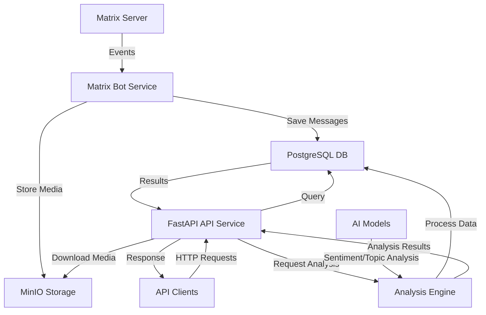

# Matrix Historian Documentation

Welcome to the Matrix Historian documentation! This comprehensive guide will help you understand, deploy, and use the Matrix Historian message archival system.

## 📚 Documentation Sections

### 1. **[Overview](./overview.md)**
   - What is Matrix Historian?
   - Architecture overview
   - Core components and features
   - Use cases and technology stack

### 2. **[Get Started](./get-started.md)**
   - Quick start guide (5-minute setup)
   - Basic configuration
   - First-time setup walkthrough
   - Common tasks and troubleshooting

### 3. **[Deployment Guide](./deployment.md)**
   - Docker Compose deployment (recommended)
   - Manual installation
   - Kubernetes deployment
   - Cloud platform setup (AWS, GCP, Azure)
   - Configuration details and scaling

### 4. **[Development Guide](./development.md)**
   - Development environment setup
   - Project structure
   - Coding standards and practices
   - Testing and debugging
   - Contributing guidelines

### 5. **[API Reference](./reference/api-reference.md)**
   - Complete API documentation
   - Endpoint specifications
   - Request/response examples
   - Authentication and rate limiting

## 🚀 Quick Links

- **GitHub Repository**: [WeepingDogel/matrix-historian](https://github.com/WeepingDogel/matrix-historian)
- **Live Demo**: [Coming Soon]
- **Issue Tracker**: [GitHub Issues](https://github.com/WeepingDogel/matrix-historian/issues)
- **Matrix Room**: [#matrix-historian:matrix.org](https://matrix.to/#/#matrix-historian:matrix.org)

## 🎯 What is Matrix Historian?

Matrix Historian is a powerful, microservices-based message archival and analysis tool for Matrix chat platforms. It automatically archives messages from Matrix rooms, stores media files, and provides a comprehensive REST API for querying and analyzing chat history.

### Key Features

- **Automatic Archiving**: Real-time capture of Matrix room messages
- **Media Storage**: S3-compatible storage for images, videos, and files
- **REST API**: Comprehensive API for searching and retrieving messages
- **Microservices Architecture**: Scalable, containerized services
- **Analytics**: Message statistics and insights
- **Docker Support**: Easy deployment with Docker Compose

## 🏗️ Architecture



## 📦 Quick Installation

```bash
# Clone the repository
git clone https://github.com/WeepingDogel/matrix-historian.git
cd matrix-historian

# Configure environment
cp .env.example .env
# Edit .env with your Matrix credentials

# Start services
docker-compose up -d

# Verify installation
curl http://localhost:8000/health
```

## 🤝 Contributing

We welcome contributions! Please see our [Development Guide](./development.md) for:

- Setting up a development environment
- Coding standards and practices
- Testing procedures
- Pull request guidelines

## 🆘 Support

### Getting Help

1. **Check the Documentation**: Most questions are answered in these docs
2. **Search Issues**: Check existing GitHub issues
3. **Ask in Matrix Room**: Join our community room
4. **Open an Issue**: For bugs or feature requests

### Common Issues

- **Bot connection issues**: Verify Matrix credentials in `.env`
- **Database problems**: Check PostgreSQL logs and connection settings
- **API not responding**: Verify service status and port availability
- **Media storage**: Check MinIO configuration and permissions

## 📄 License

Matrix Historian is open source software licensed under the [MIT License](https://github.com/WeepingDogel/matrix-historian/blob/main/LICENSE).

## 🙏 Acknowledgments

- Built with ❤️ by the open source community
- Uses [matrix-nio](https://github.com/poljar/matrix-nio) for Matrix connectivity
- Powered by [FastAPI](https://fastapi.tiangolo.com/) for the REST API
- Thanks to all contributors and users!

---

*Last Updated: February 2026*  
*Documentation Version: 1.0.0*