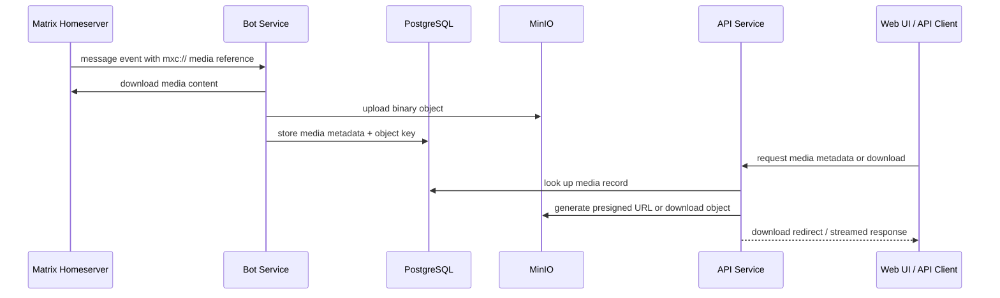

# Media Storage Guide

This guide explains how Matrix Historian stores, serves, and exposes archived media.

## Overview

Matrix Historian separates **message/archive metadata** from **binary media storage**:

- **PostgreSQL** stores message records, room/user references, and media metadata
- **MinIO** stores the actual attachment objects (images, files, audio, video)

This separation keeps archive queries efficient while allowing media storage to scale independently.

## Media flow



## What gets stored where

### PostgreSQL

The database stores metadata such as:
- media id
- room id
- sender id
- source message id
- MIME type
- original filename
- object key / bucket reference
- timestamps and archive relationships

### MinIO

MinIO stores the binary object itself:
- images
- videos
- audio files
- generic attachments
- derived media objects such as thumbnails or cached avatars when applicable

## Runtime components involved

### Bot service

The bot service is responsible for:
- detecting media-bearing Matrix events
- downloading media from Matrix using the original `mxc://` reference
- uploading the binary object into MinIO
- creating the corresponding media metadata record in PostgreSQL

### API service

The API service is responsible for:
- listing media entries
- returning media metadata
- generating download access for stored objects
- exposing `/api/v1/media/...` endpoints to the web UI and API clients

### Web service

The web frontend is responsible for:
- browsing archived media
- rendering previews when possible
- linking downloads through the API layer

## Access model

Matrix Historian supports two broad media access patterns.

### 1. API-mediated download

This is the default and safest model.

The client requests:
- `/api/v1/media/{media_id}` for metadata
- `/api/v1/media/{media_id}/download` for the actual file

The API can then:
- generate a presigned MinIO URL and redirect the client
- or stream the object directly if needed

This keeps MinIO behind the application boundary while still allowing efficient downloads.

### 2. Public/external object access

If `MINIO_PUBLIC_URL` is configured, the system can produce externally reachable URLs based on a public MinIO-facing address.

This is useful when:
- Matrix Historian is self-hosted behind a domain
- users need browser-accessible media links
- archived media should be reachable outside the Docker network
- the deployment is intentionally used as a lightweight object-backed media host

## `MINIO_PUBLIC_URL`

`MINIO_PUBLIC_URL` is optional.

Use it when MinIO should be reachable from outside the internal Docker network.

Example:

```env
MINIO_PUBLIC_URL=https://minio.example.com
```

Typical use cases:
- reverse-proxied MinIO under a public domain
- LAN-accessible self-hosted setup
- object storage exposed for controlled external access

If omitted:
- MinIO can still work perfectly for internal storage
- downloads can still be served through the API
- but raw MinIO URLs may not be externally usable from a browser outside the Docker/network boundary

## Can it be used like an image host?

Yes — with caveats.

Because media is stored in MinIO, the project can function as an object-backed media host for archived Matrix attachments. In practice, this means it can behave somewhat like an internal or self-hosted image bed.

However, the exact behavior depends on deployment choices:

### Good fit
- self-hosted archival system
- private media browsing through the web UI
- controlled external sharing through API-generated or public MinIO URLs
- attachment persistence independent of Matrix retention rules

### Things to decide explicitly
- whether MinIO should be public or private
- whether downloads should go through presigned URLs only
- whether bucket policies allow anonymous access
- whether CDN or reverse proxy caching is desired
- whether media links should be durable or short-lived

In other words: **the storage layer makes image-hosting-like behavior possible, but access policy is still a deployment decision**.

## Recommended deployment patterns

### Private-first deployment

Recommended for most self-hosted setups.

- keep MinIO private
- do not expose buckets anonymously
- let the API generate presigned downloads
- expose only the web app and API through your main reverse proxy

Benefits:
- simpler access control
- fewer accidental public objects
- easier to reason about security

### Public media endpoint deployment

Useful when archived media must be easily shared.

- expose MinIO or a proxy path publicly
- configure `MINIO_PUBLIC_URL`
- decide whether URLs are public, signed, or proxied
- add caching and size/rate controls where appropriate

Benefits:
- direct browser access
- easier embedding of media links
- better offloading for large file delivery

Trade-offs:
- stronger need for bucket policy review
- more operational/security considerations
- more care required around privacy expectations for archived content

## Operational notes

### Buckets

The default bucket is:

```env
MINIO_BUCKET=matrix-media
```

If you change it, ensure:
- the bot uploads into the same bucket the API expects
- the deployment environment stays consistent across services

### Persistence

For production-like deployments, persist both:
- PostgreSQL data
- MinIO object data

Losing PostgreSQL breaks archive metadata.
Losing MinIO breaks media object retrieval even if metadata still exists.

### Backups

Back up both layers together when possible:
- PostgreSQL dump / snapshot
- MinIO object data / bucket backup

A metadata-only backup is incomplete.
An object-only backup is also incomplete without the database mappings.

## Troubleshooting

### Media exists in UI metadata but download fails

Check:
- MinIO service health
- `MINIO_ENDPOINT`
- object existence in the configured bucket
- whether the stored object key still exists
- API logs for presign or streaming errors

### Media upload from bot fails

Check:
- Matrix media download success from the bot
- MinIO credentials and endpoint
- bucket existence and permissions
- bot logs for upload exceptions

### Public URLs do not work

Check:
- `MINIO_PUBLIC_URL`
- reverse proxy configuration
- TLS/certificate setup
- bucket access policy
- whether the generated URL is expected to be public or signed

## Related docs

- [Overview](./overview.md)
- [Get Started](./get-started.md)
- [Deployment](./deployment.md)
- [API Reference](./reference/api-reference.md)
