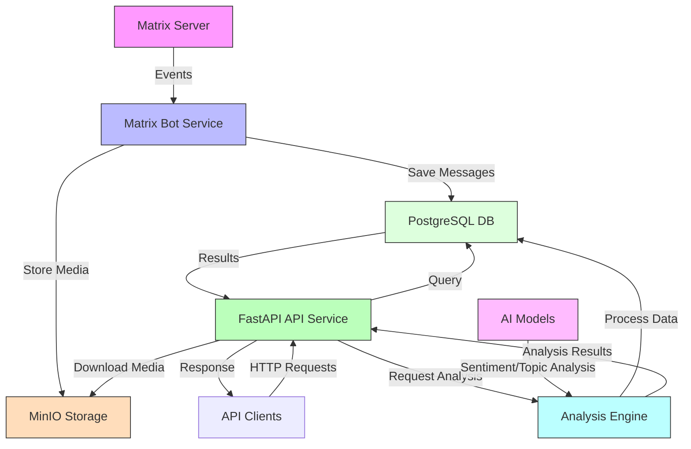

# Matrix Historian - Overview

## What is Matrix Historian?

Matrix Historian is a powerful, microservices-based message archival and analysis tool for Matrix chat platforms. It automatically archives messages from Matrix rooms, stores media files, and provides a comprehensive REST API for querying and analyzing chat history.

## Architecture Overview

## Core Components

### 1. Bot Service (`services/bot/`)
- **Purpose**: Connects to Matrix homeserver and listens for messages
- **Features**:
  - Real-time message archiving from configured rooms
  - Media file download and storage
  - User presence tracking
  - Room membership management
- **Technology**: Python, matrix-nio

### 2. API Service (`services/api/`)
- **Purpose**: Provides RESTful API for accessing archived data
- **Features**:
  - Message search and filtering
  - Media file retrieval
  - Analytics endpoints
  - User and room statistics
- **Technology**: FastAPI, PostgreSQL, MinIO

### 3. Shared Package (`shared/`)
- **Purpose**: Common utilities and models used across services
- **Features**:
  - Database models and schemas
  - Storage utilities (MinIO/S3 compatible)
  - Configuration management
  - Common helper functions

### 4. Storage Backends
- **PostgreSQL**: Primary database for messages, users, rooms metadata
- **MinIO**: Object storage for media files (images, videos, documents)

## Key Features

### Message Archiving
- Automatic capture of all messages in configured rooms
- Support for text, images, videos, files, and other media types
- Preservation of message metadata (timestamps, sender, room, etc.)

### Search & Retrieval
- Full-text search across all archived messages
- Filter by room, user, date range, and content type
- Pagination and sorting options

### Media Management
- Automatic download and storage of media attachments
- S3-compatible storage with MinIO
- Media preview generation and thumbnail support

### Analytics & Insights
- Message volume statistics
- User activity analysis
- Room engagement metrics
- Sentiment analysis (planned)

### API-First Design
- Comprehensive REST API with OpenAPI documentation
- Support for multiple client types (web, mobile, CLI)
- Authentication and authorization

## Use Cases

### 1. Community Archives
- Preserve important community discussions
- Create searchable knowledge bases
- Archive announcements and decisions

### 2. Research & Analysis
- Study communication patterns
- Analyze community engagement
- Track topic evolution over time

### 3. Compliance & Governance
- Maintain records for regulatory compliance
- Audit trails for organizational communications
- Evidence preservation

### 4. Personal Archives
- Backup personal conversations
- Search through chat history
- Media file organization

## Technology Stack

- **Backend**: Python 3.9+, FastAPI, SQLAlchemy
- **Database**: PostgreSQL 14+
- **Storage**: MinIO (S3-compatible object storage)
- **Matrix SDK**: matrix-nio
- **Containerization**: Docker, Docker Compose
- **Deployment**: Kubernetes-ready microservices

## Project Status

✅ **Stable**: Core archiving functionality  
✅ **Stable**: REST API with comprehensive endpoints  
✅ **Stable**: Media storage and retrieval  
🔄 **In Development**: Advanced analytics features  
📋 **Planned**: Web interface for browsing archives  
📋 **Planned**: Real-time search indexing  

## Getting Started

1. **Quick Start**: See [Get Started](./get-started.md) for a 5-minute setup
2. **Deployment**: Follow the [Deployment Guide](./deployment.md) for production setup
3. **Development**: Check [Development Guide](./development.md) for contributing
4. **API Reference**: Browse the [API Documentation](./reference/api-reference.md)

## Community & Support

- **Issues**: Report bugs or request features on GitHub
- **Contributions**: Pull requests welcome!
- **Questions**: Open a discussion for help

---

*Matrix Historian - Preserving your conversations, empowering your analysis.*