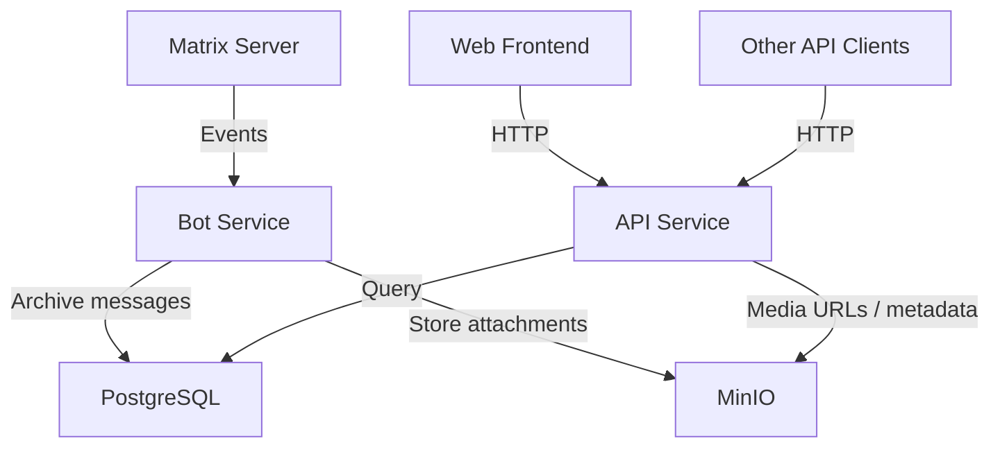

# Matrix Historian Overview

## What Matrix Historian is

Matrix Historian is a Matrix message archival and analytics system.

It currently consists of:
- a **Matrix bot service** for ingestion
- a **FastAPI service** for querying and analytics
- a **Svelte web frontend** for browsing and visualization
- **PostgreSQL** for archived metadata and messages
- **MinIO** for archived media objects

## Architecture

```mermaid
graph TB
    A[Matrix Server] -->|Events| B[Bot Service]
    B -->|Archive messages| C[PostgreSQL]
    B -->|Store attachments| D[MinIO]

    E[Web Frontend] -->|HTTP| F[API Service]
    G[Other API Clients] -->|HTTP| F
    F -->|Query| C
    F -->|Media URLs / metadata| D
```

## Core components

### Bot service (`services/bot/`)
- connects to Matrix
- archives message events
- downloads supported media and uploads it to MinIO

### API service (`services/api/`)
- exposes `/api/v1` endpoints
- provides search, listing, analytics, and media metadata APIs
- serves Swagger docs at `/docs`

### Web service (`services/web/`)
- SvelteKit frontend
- archive browsing and analytics UI
- supports English and Simplified Chinese
- supports Local / UTC timestamp display modes

### Shared package (`shared/`)
- SQLAlchemy models
- Pydantic schemas
- CRUD helpers
- DB and storage utilities

## Timezone model

A key design point:

- timestamps are persisted as **UTC** in the backend/database
- timestamps are formatted for display in the **frontend**
- users can switch display between **Local** and **UTC** without backend changes

## Internationalization model

The current web UI supports:
- `en`
- `zh-CN`

Language selection is handled client-side and used only for presentation.

## Key capabilities

- automatic Matrix archiving
- text and metadata search
- room and user filtering
- media archival with MinIO
- analytics endpoints and UI views
- Docker-based self-hosting

## Current status

### Stable
- message archiving
- API service
- PostgreSQL + MinIO storage
- web frontend
- frontend i18n (`en`, `zh-CN`)
- frontend timezone display controls

### Documentation alignment

This overview matches the current main-branch architecture:
- Matrix bot ingestion
- FastAPI API service
- PostgreSQL + MinIO storage
- web frontend
- frontend i18n (`en`, `zh-CN`)
- frontend timezone display controls

When extending docs, keep terminology aligned with the current `services/` and `shared/` layout.
