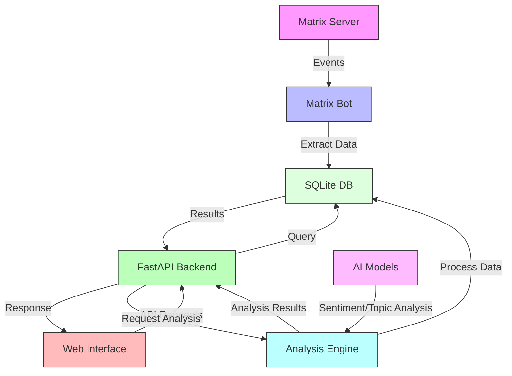

# Category
* [Overview](./overview.md)
* [Get Started](./get-started.md)
* [Deployment](./deployment.md)
* [Development](./development.md)
* [API Reference](./reference/api-reference.md)
* [Frontend Migration Plan](./frontend-migration-plan.md)
* [Frontend Migration Summary](./frontend-migration-summary.md)

---

# Project Overview

Matrix Historian is a service for archiving and searching messages from Matrix rooms. It automatically collects historical messages, supports filtering by room and user, and provides a web interface for easy browsing and searching.

## Features
- Automatic message archival.
- Search messages by content, room, and user.
- RESTful API built with FastAPI.
- Web interface powered by Streamlit.
- Docker deployment support.
- Uses SQLite for message storage.

## Architecture
- Backend: FastAPI, SQLAlchemy
- Frontend: Streamlit
- Database: SQLite
- Matrix Bot: SimpleMatrixBotLib for message collection
 - Analytics: Additional endpoints under `/api/v1/analytics/*` for overviews, word clouds, user networks, heatmaps, trends, and AI-assisted sentiment analysis

## Technology Stack
- **Backend**:
    - Python 3.12
    - FastAPI: Web framework for building the API
    - SQLAlchemy: ORM for database interactions
    - SQLite: Database for storing messages
- **Frontend**:
    - Streamlit: Python library for creating interactive web apps
    - Pandas: Data analysis and manipulation tool
- **Matrix Bot**:
    - SimpleMatrixBotLib: Library for creating Matrix bots
## Data Flow
Here is a visual representation of how data flows through the system:

1. The Matrix Bot connects to the Matrix server using SimpleMatrixBotLib.
2. When a new message is sent in a room, the bot receives the message event.
3. The bot extracts relevant information (sender, room, content, timestamp) from the event.
4. The bot stores the message in the SQLite database using SQLAlchemy.
5. Users can search and browse messages through the Streamlit web interface.
6. The web interface makes API requests to the FastAPI backend to retrieve messages from the database.
7. The FastAPI backend queries the database using SQLAlchemy and returns the results to the web interface.
